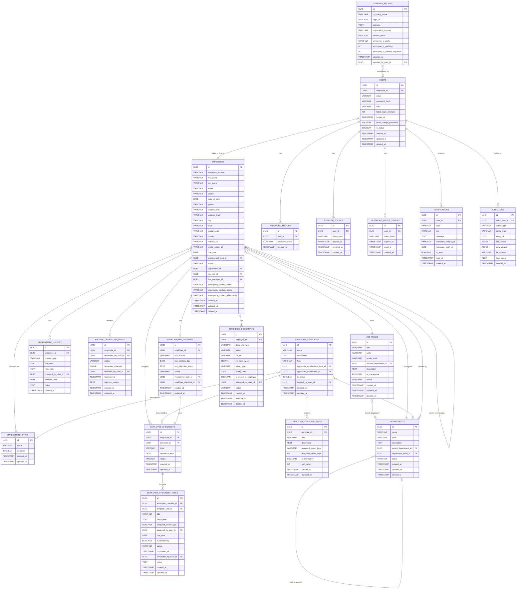

# Employee Management System — Database Schema Design

> **Database:** PostgreSQL
> **ORM:** Spring Data JPA / Hibernate
> **Delete Strategy:** Soft delete (deleted_at) on all key entities
> **File Storage:** File path / URL reference (files stored externally, e.g., S3 or local disk)
> **Audit Strategy:** Dedicated `audit_logs` table capturing all CREATE / UPDATE / DELETE actions

---

## Entity Inventory

| # | Entity | Package | Purpose |
|---|--------|---------|---------|
| 1 | `company_profile` | system | Company settings and employee ID format config |
| 2 | `employment_types` | organization | Configurable employment types (Full-time, Part-time, etc.) |
| 3 | `departments` | organization | Org structure with self-referential parent/child support |
| 4 | `job_roles` | organization | Job titles with grade levels and managerial flag |
| 5 | `employees` | employee | Core employee record (personal + employment info) |
| 6 | `users` | auth | System user accounts linked to employees |
| 7 | `password_history` | auth | Last 5 password hashes per user (prevents reuse) |
| 8 | `refresh_tokens` | auth | HTTP-only cookie refresh tokens with server-side revocation |
| 9 | `password_reset_tokens` | auth | One-time password reset links (1-hour expiry) |
| 10 | `employment_history` | employee | Structured log of role / dept / manager / status changes |
| 11 | `profile_update_requests` | employee | Employee self-service change requests pending HR approval |
| 12 | `checklist_templates` | checklist | Onboarding and offboarding template definitions |
| 13 | `checklist_template_tasks` | checklist | Task definitions within a template |
| 14 | `employee_checklists` | checklist | Template instance assigned to a specific employee |
| 15 | `employee_checklist_tasks` | checklist | Individual task instances within an employee checklist |
| 16 | `offboarding_records` | offboarding | Exit details including reason, last day, and interview notes |
| 17 | `employee_documents` | document | File references for contracts, IDs, certificates, etc. |
| 18 | `notifications` | notification | In-app notifications for each user |
| 19 | `audit_logs` | audit | Immutable log of all system actions |

---

## Enum Reference

| Enum | Values |
|------|--------|
| `UserRole` | `SUPER_ADMIN`, `HR_MANAGER`, `DEPT_MANAGER`, `EMPLOYEE` |
| `Gender` | `MALE`, `FEMALE`, `OTHER`, `PREFER_NOT_TO_SAY` |
| `EmployeeStatus` | `ACTIVE`, `INACTIVE`, `PENDING` |
| `GradeLevel` | `JUNIOR`, `ASSOCIATE`, `L3`, `SENIOR`, `MANAGER`, `EXPERT` |
| `DepartmentStatus` | `ACTIVE`, `INACTIVE` |
| `JobRoleStatus` | `ACTIVE`, `INACTIVE` |
| `EmploymentHistoryChangeType` | `DEPARTMENT_CHANGE`, `ROLE_CHANGE`, `MANAGER_CHANGE`, `STATUS_CHANGE`, `EMPLOYMENT_TYPE_CHANGE` |
| `ChecklistType` | `ONBOARDING`, `OFFBOARDING` |
| `ChecklistStatus` | `IN_PROGRESS`, `COMPLETED`, `CANCELLED` |
| `ChecklistTaskStatus` | `PENDING`, `COMPLETED`, `OVERDUE`, `SKIPPED` |
| `OwnerType` | `HR`, `IT`, `MANAGER`, `EMPLOYEE`, `FINANCE` |
| `ExitReason` | `RESIGNATION`, `TERMINATION`, `RETIREMENT`, `REDUNDANCY` |
| `OffboardingStatus` | `INITIATED`, `IN_PROGRESS`, `COMPLETED` |
| `DocumentType` | `CONTRACT`, `NATIONAL_ID`, `CERTIFICATE`, `CV`, `PASSPORT`, `OTHER` |
| `DocumentStatus` | `PENDING_REVIEW`, `APPROVED`, `REJECTED` |
| `ProfileUpdateStatus` | `PENDING`, `APPROVED`, `REJECTED` |
| `AuditActionType` | `CREATE`, `UPDATE`, `DELETE`, `VIEW_SENSITIVE`, `DOWNLOAD` |
| `NotificationType` | `ONBOARDING_TASK_DUE`, `OFFBOARDING_TASK_DUE`, `DOCUMENT_EXPIRY`, `PROFILE_UPDATE_REQUEST`, `ROLE_CHANGE`, `DEPT_TRANSFER`, `NEW_ACCOUNT`, `PASSWORD_RESET`, `TASK_ASSIGNED` |

---

## Entity Relationship Diagram



---

## Key Design Decisions

### Soft Deletes
All entities with `deleted_at` support soft deletion. Queries must filter `WHERE deleted_at IS NULL` for active records. Use `@Where(clause = "deleted_at IS NULL")` on entities via Hibernate filters.

### UUID Primary Keys
All tables use `UUID` primary keys generated via `@UuidGenerator` (Hibernate 6+) for distribution-safe IDs.

### Employment History vs Audit Log
- **`audit_logs`** — raw technical log of every field change across the entire system (actor, action, entity, old JSON, new JSON). Used by Super Admin.
- **`employment_history`** — structured HR-focused log scoped to key employment events (department transfer, role change, etc.). Used by HR Manager on an employee's profile tab.

### JSONB Columns
`profile_update_requests.requested_changes`, `audit_logs.old_values`, and `audit_logs.new_values` use PostgreSQL `JSONB` for flexible key-value storage. Mapped using `@JdbcTypeCode(SqlTypes.JSON)` in Hibernate 6+.

### Circular References (Department ↔ Employee)
- `departments.department_head_id` → `employees.id` (a department head is an employee)
- `employees.department_id` → `departments.id` (an employee belongs to a department)

This is a circular FK reference. At the DB level it is valid. At the application level, use `@JsonIgnore` or DTOs to avoid serialization loops.

### Self-Referential Relationships
- `departments.parent_department_id` → `departments.id` (sub-departments)
- `employees.line_manager_id` → `employees.id` (reporting hierarchy)

Circular manager chains (A → B → A) are prevented at the service layer before persisting.

### Checklist Template Pattern
Both onboarding and offboarding use the same two-level template pattern:
```
checklist_templates (type = ONBOARDING | OFFBOARDING)
    └── checklist_template_tasks (with due_date_offset_days)

employee_checklists (instantiated from a template)
    └── employee_checklist_tasks (calculated due_date = reference_date + offset)
```
`reference_date` = hire date for onboarding, last working day for offboarding.

### Company Profile (Single-Row Table)
`company_profile` is a singleton configuration table. Application code enforces that only one row exists. It stores both company identity fields and the employee ID auto-generation config (prefix, padding digits, current sequence).
